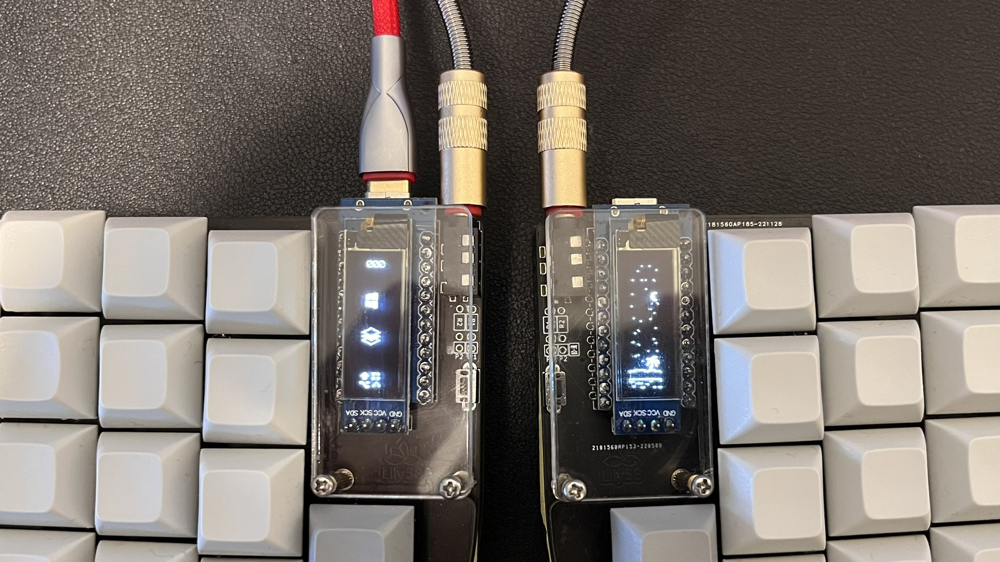

# Bartek's Lily58 Config

Put files in 
~/Users/xxxxx/qmk_firmware/keyboards/lily58/keymaps/bartektelec

If run into problems with font being declared twice, remove it from
~/Users/xxxxx/qmk_firmware/keyboards/lily58/config.h

Run from QMK MSYS:
`qmk compile -kb lily58/rev1 -km bartektelec`

Output dir is `~/Users/xxxxxx/qmk_firmware/.build/lily58_rev1_bartektelec.hex`
Flash the output with QMK Toolbox

TODOs

- [ ] Test compatibility with MacOS, may need to use Alt(Option)->Cmd(GUI) swap with QK_MAGIC_TOGGLE_ALT_GUI
- [ ] Add a script to sync it with Corne layout 
